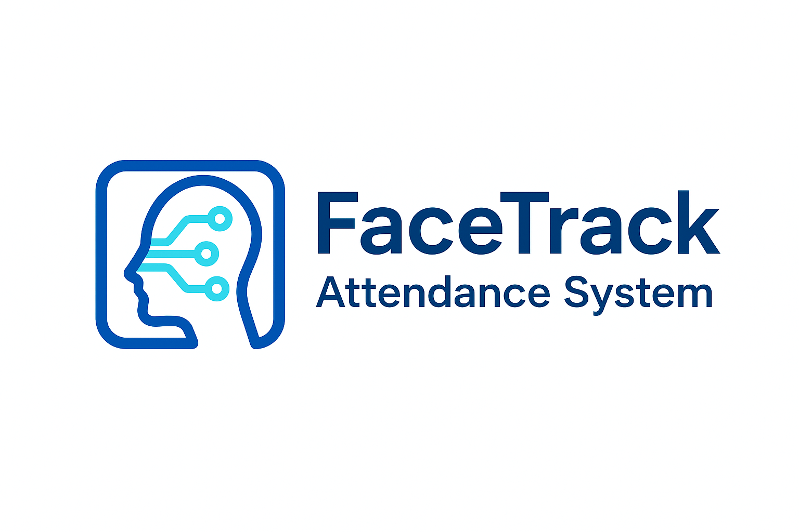

# 📚 Face Recognition Based Attendance System

face_attendance.png

<p align="center">
  
</p>

A Flask Web Application Using OpenCV & Machine Learning

This is a **Face Recognition Based Attendance System** built using **Python**, **OpenCV**, **Flask**, and **KNN Machine Learning Model**.
It captures student faces, trains a model, recognizes faces in real-time, marks attendance automatically, and sends email notifications to parents.

---

## 🚀 Features

### ✔️ **Face Registration**

* Capture 50 face images through webcam
* Save images under each student
* Automatically trains the KNN model after new registration

### ✔️ **Real-Time Face Recognition**

* Detects student faces using Haarcascade
* Predicts identity using trained KNN model
* Marks attendance instantly

### ✔️ **Attendance Management**

* Stores attendance in `Attendance/Attendance-<date>.csv`
* CSV contains:

  * Name
  * Roll Number
  * Time

### ✔️ **Email Notification**

* Sends email to parents when attendance is recorded
* Uses **SMTP (Gmail)**

### ✔️ **Admin Panel**

* Admin login (`admin/admin`)
* View daily attendance
* Add new student

---

## 🛠️ Tech Stack

| Component        | Technology                    |
| ---------------- | ----------------------------- |
| Backend          | Flask                         |
| Face Detection   | OpenCV Haarcascade            |
| Face Recognition | KNN Classifier (scikit-learn) |
| Data Storage     | CSV                           |
| Email Service    | smtplib (Gmail SMTP)          |
| Frontend         | HTML Templates (Jinja2)       |

---

## 📁 Project Structure

```
project/
│── app.py
│── static/
│   ├── faces/
│   ├── face_recognition_model.pkl
│   └── haarcascade_frontalface_default.xml
│
│── Attendance/
│   └── Attendance-<date>.csv
│
│── templates/
│   ├── home.html
│   ├── admin.html
│   └── adminhome.html
│
└── requirements.txt
```

---

## ▶️ How to Run the Project

### **1. Clone the Repository**

```bash
git clone <your-repository-url>
cd <project-folder>
```

### **2. Install Dependencies**

```bash
pip install -r requirements.txt
```

(or)

```bash
pip install flask opencv-python numpy scikit-learn pandas joblib
```

### **3. Run the Application**

```bash
python app.py
```

Flask will start at:

```
http://127.0.0.1:5000/
```

---

## 🧪 Model Training

Model trains automatically when a **new student is added**.

Algorithm used: **K-Nearest Neighbors (KNN)**
Image Preprocessing:

* Resize to **50×50 pixels**
* Convert to 1D vector (flatten)
* Train using all stored face images

---

## 📨 Email Notification Setup

The application uses Gmail SMTP:

```python
sender_email = "vlbuser86@gmail.com"
password = "your-app-password"
```

To use Gmail:

1. Enable **2-Step Verification**
2. Generate an **App Password**
3. Replace in the code

---

## 🎯 User Flow

### **Student Registration**

1. Admin enters Name, Roll No, Parent Email
2. System captures 50 face images
3. Model retrains automatically

### **Attendance**

1. User clicks **Start Attendance**
2. Webcam opens
3. System recognizes face
4. Attendance saved to CSV
5. Email sent to parent

---

## 📌 Admin Login

| Username | Password |
| -------- | -------- |
| admin    | admin    |

---

## 📸 Screenshots (Optional)

You can add screenshots such as:

* Home Page
* Admin Login
* Face Capture
* Attendance CSV

Example:

```

```

---

## 📄 License

This project is open-source and free to use for educational purposes.

---

## 👨‍💻 Author

**Sivan Sakthivel**
Final Year BSc Computer Science Project — Face Recognition Attendance System

---
